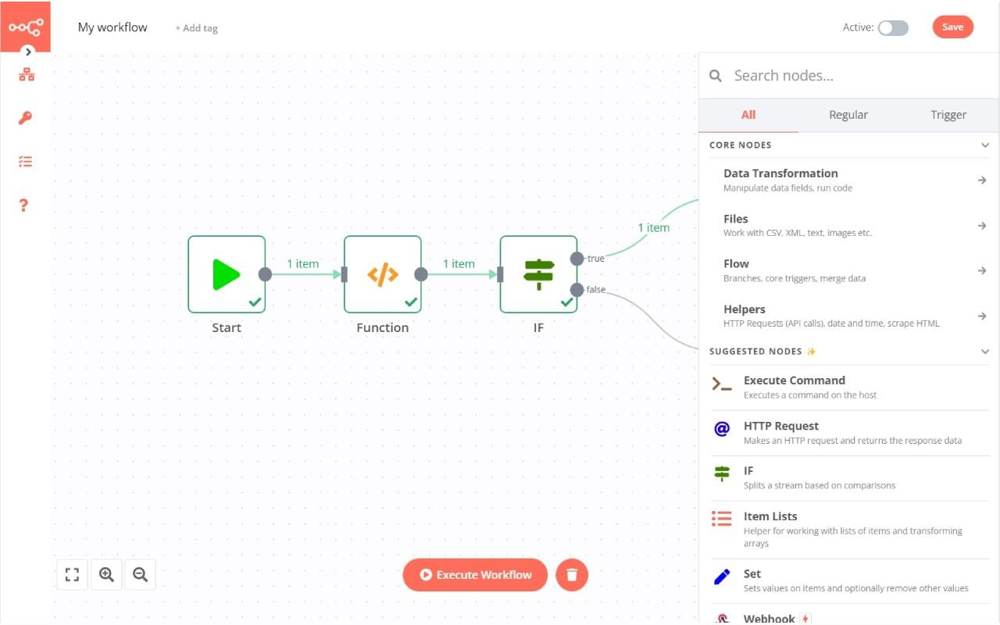

# N8N CI/CD pipeline

Deploy N8N server with CI/CD on Elestio

 
 

# Once deployed ...

You can open N8N UI here and first register with the email below:

    URL: https://[CI_CD_DOMAIN]
    login: [ADMIN_EMAIL]
    password: [SOFTWARE_PASSWORD]

More information about N8N usage can also be found in the documentation.: https://docs.n8n.io/

# Note: 
By default, automatic data pruning is enabled for execution logs, and the record should be deleted 14 days after execution.

If you want to enable/disable or change the number of hours then you can do it by:
Open Elestio dashboard > Service overview > Click on the Update CONFIG button > Env tab their edit 'EXECUTIONS_DATA_PRUNE', & 'EXECUTIONS_DATA_MAX_AGE' and click the button 'Update & Restart'.
